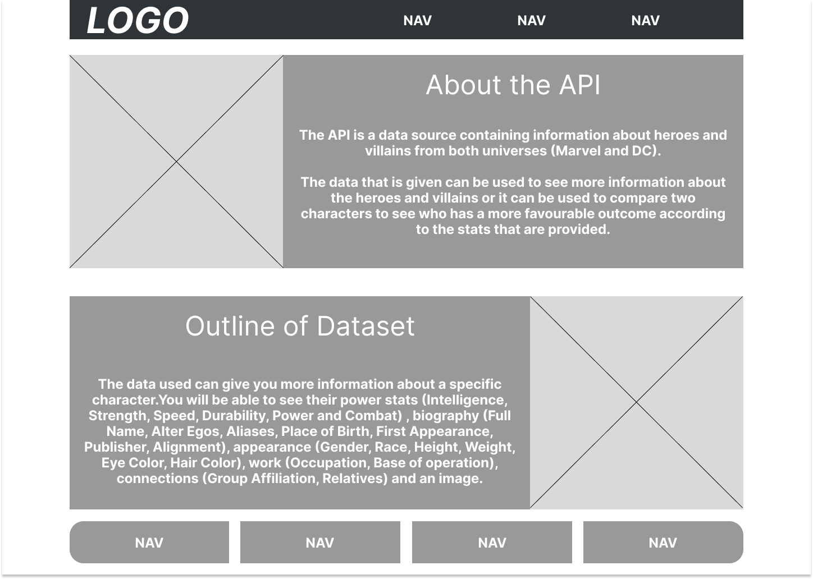
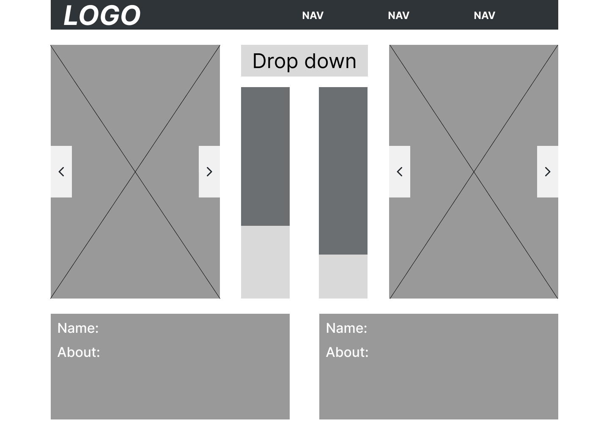
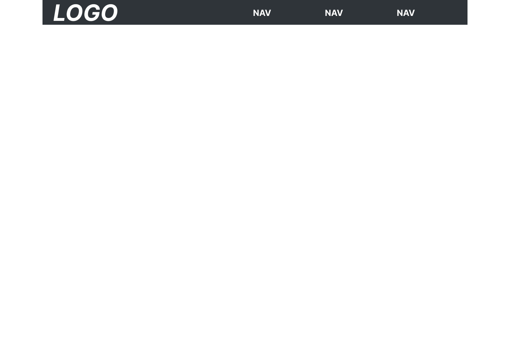
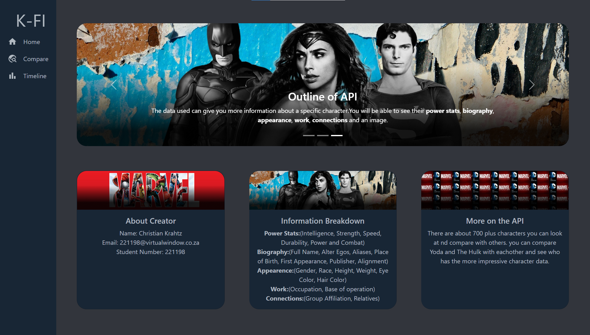
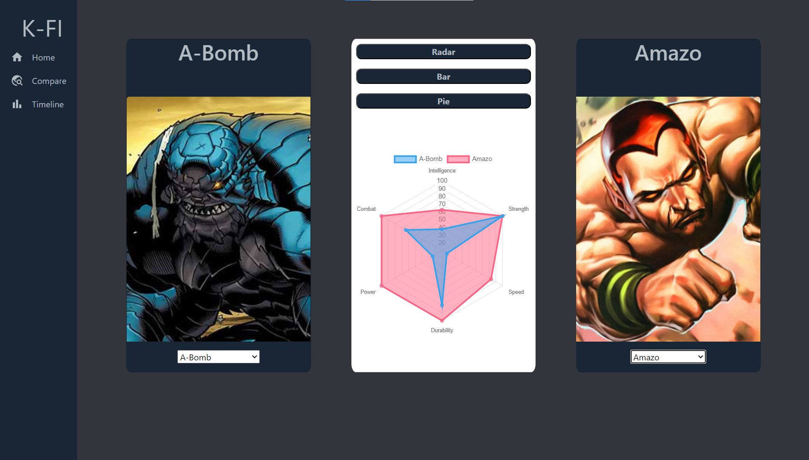
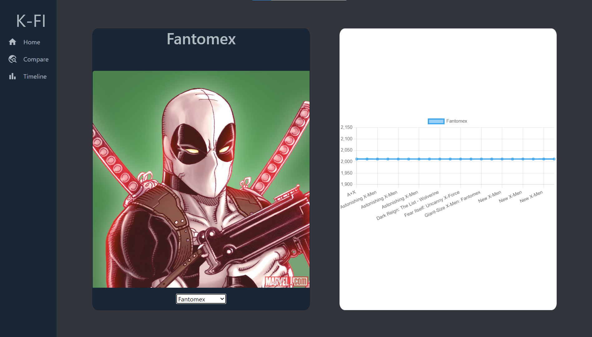
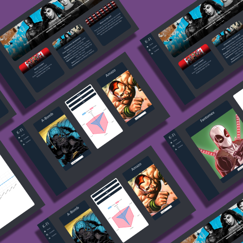
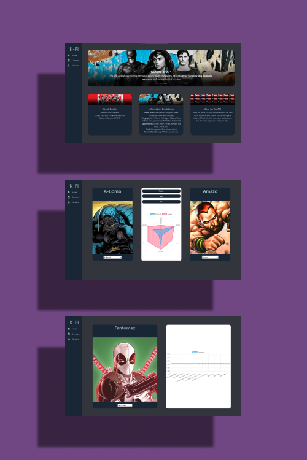
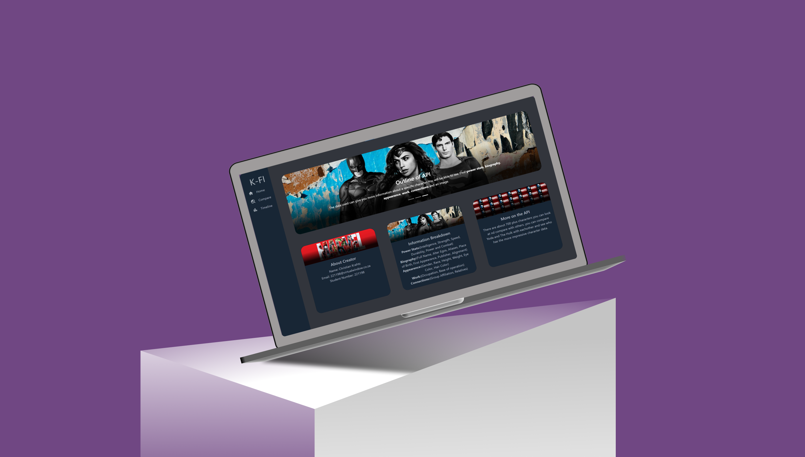

<h1 align="center" style="padding:0;margin:0;">KrahtzHero: a web application created using React</h1>
<h3 align="center" style="padding:0;margin:0;">Website</h3>
<h4 align="center">Christian Krahtz</h4>
<h6 align="center">DV200 | Term 1</h6>

## Table of Contents

- [Getting Started](#getting-started-with-create-react-app)
    - [Script](#available-scripts)
    - [Learn More](#learn-more)
- [Features And Functionality](#features-and-functionality)
    - [Home Page/Dashboard](#home-page)
    - [Compare Page](#compare-page)
    - [Timeline Page](#timeline-page)
- [Concept Process](#concept-process)
    - [Ideation](#ideation)    
    - [The API](#the-api)    
    - [Wireframes](#wireframes)    
    - [UI](#ui)    
- [Developement Process](#developement-process)
    - [Implementation Process](#implementation-process)
        - [Highlights](#highlights)
        - [Challenges](#challenges)
    - [Future Implementation](#future-implementation)
- [Final Outcome](#final-outcome)
    - [Mockups](#mockups)
    - [Walkthrough](#walkthrough)
- [Conclusion](#conclusion)
- [Author](#author)
- [Acknowledgements](#acknowledgements)

# Getting Started with Create React App

This project was bootstrapped with [Create React App](https://github.com/facebook/create-react-app).

## Available Scripts

In the project directory, you can run:

### `npm start`

Runs the app in the development mode.\
Open [http://localhost:3000](http://localhost:3000) to view it in your browser.

The page will reload when you make changes.\
You may also see any lint errors in the console.

### `npm test`

Launches the test runner in the interactive watch mode.\
See the section about [running tests](https://facebook.github.io/create-react-app/docs/running-tests) for more information.

### `npm run build`

Builds the app for production to the `build` folder.\
It correctly bundles React in production mode and optimizes the build for the best performance.

The build is minified and the filenames include the hashes.\
Your app is ready to be deployed!

See the section about [deployment](https://facebook.github.io/create-react-app/docs/deployment) for more information.

### `npm run eject`

**Note: this is a one-way operation. Once you `eject`, you can't go back!**

If you aren't satisfied with the build tool and configuration choices, you can `eject` at any time. This command will remove the single-build dependency from your project.

Instead, it will copy all the configuration files and the transitive dependencies (webpack, Babel, ESLint, etc) right into your project so you have full control over them. All of the commands except `eject` will still work, but they will point to the copied scripts so you can tweak them. At this point, you're on your own.

You don't have to ever use `eject`. The curated feature set is suitable for small and middle deployments, and you shouldn't feel obligated to use this feature. However, we understand that this tool wouldn't be useful if you couldn't customize it when you are ready for it.

## Learn More

You can learn more in the [Create React App documentation](https://facebook.github.io/create-react-app/docs/getting-started).

To learn React, check out the [React documentation](https://reactjs.org/).

### Code Splitting

This section has moved here: [https://facebook.github.io/create-react-app/docs/code-splitting](https://facebook.github.io/create-react-app/docs/code-splitting)

### Analyzing the Bundle Size

This section has moved here: [https://facebook.github.io/create-react-app/docs/analyzing-the-bundle-size](https://facebook.github.io/create-react-app/docs/analyzing-the-bundle-size)

### Making a Progressive Web App

This section has moved here: [https://facebook.github.io/create-react-app/docs/making-a-progressive-web-app](https://facebook.github.io/create-react-app/docs/making-a-progressive-web-app)

### Advanced Configuration

This section has moved here: [https://facebook.github.io/create-react-app/docs/advanced-configuration](https://facebook.github.io/create-react-app/docs/advanced-configuration)

### Deployment

This section has moved here: [https://facebook.github.io/create-react-app/docs/deployment](https://facebook.github.io/create-react-app/docs/deployment)

### `npm run build` fails to minify

This section has moved here: [https://facebook.github.io/create-react-app/docs/troubleshooting#npm-run-build-fails-to-minify](https://facebook.github.io/create-react-app/docs/troubleshooting#npm-run-build-fails-to-minify)

# Features And Functionality
## Home Page

The home page or the dashboard I created to inform the user more about what the project is about and what datasets will be used.
    
## Compare Page
There are a total of 730 heroes but due to the loading time, I only used a total of 20 heroes per dropdown. It gives a variety of heroes to compare and The amount can be increased or decreased on the developer side.

The user can change the selected hero to update the given data that is being displayed on the chart(s). The user will also be able to change the chart type by clicking on the button of the given chart name. 

The user can either show one at a time or more than one.

## Timeline Page
The timeline page shows you in what comic book(s) the selected hero has featured and in what year it was.

The selected hero can be updated by using the dropdown but for this page, we were required to use another API to fill the timeline page.

# Concept Process

## Ideation
These links I used for inspiration to create all of this. 

*    <a href="https://pin.it/6ofFcjl">DV200</a>
*    <a href="https://pin.it/6ofFcjl">DV200 Branded Component - Pinterest</a>

## The API

*    <a href="https://www.superheroapi.com/">Superhero API - Compare Page</a>
*    <a href="https://developer.marvel.com/">Marvel Developer</a>

## Wireframes
### Dashboard

### Compare

### Timeline

## UI
### Dashboard

### Compare

### Timeline

# Developement Process
## Implementation Process
For the creation of the application, I started off with getting all the documents ready to start with it.

When react was set up I added bootstrap to style the cards and make things stay in place where I would like them to. Due to my API not working from the start I used dummy data for placeholders.

After the APIs were fixed I used Chart.js and react with Axios to update the user input data on the chart display area and to have relevant information to be displayed.

### Highlights

* Dropdown being populated with the use of an API and react. It makes The navigation and creation of code much easier and less.
* Having the Charts displaying the API data after a struggle was motivating to keep on working.
* Using react to create and group elements makes it easier to understand the code and to navigate your way between code sections.
* The data is updated on the chart and the cards after a new object (hero) is selected.

### Challenges
* The understanding and implementation of react in the start was hard but with the help of other people it got easier.
* The fact that the API was not working for most of the time was stressing me out.
* The fix was to add '.php' in the Superhero API and I needed to figure out how to create the 'hash' in the Marvel API.
* The chart Options do not want to be updated

## Future Implementation
* Add chart limits for the Timeline page to see a change in the time.
* Display more heroes in the dropdown to increase to variety of heroes that the user can select from
* Display more general information on the dashboard page. 
* Display more information on the selected character on the compare page and the timeline page. Currently, it is only data being displayed on a chart.
* Increase the size of the Charts on both pages (compare and timeline).

# Final Outcome
## Mockups
 
 
 

## Walkthrough

You can view the walkthrough video <a href="https://drive.google.com/file/d/1b79qeTLukeJpwTGbaJ-9H6IEpOF9fH-F/view?usp=sharing">here</a>

# Conclusion
The use of react, chart.js, bootstrap normal styling, and HTML code was easier to use together and faster. I would recommend using React to create a website.

# Author
-    Name: Christian Krahtz
-    Email: 221198@virtualwindow.co.za
-    GitHub: <a href="https://github.com/CWKrahtz">CWKrahtz</a>

# Acknowledgements

- [W3Schools](https://www.w3schools.com/)
- [MDBootstrap](https://mdbootstrap.com/docs/react/)
- [Stack Overflow](https://stackoverflow.com/)
- [Figma](https://www.figma.com/)
- [ChatGPT](https://chat.openai.com/)
